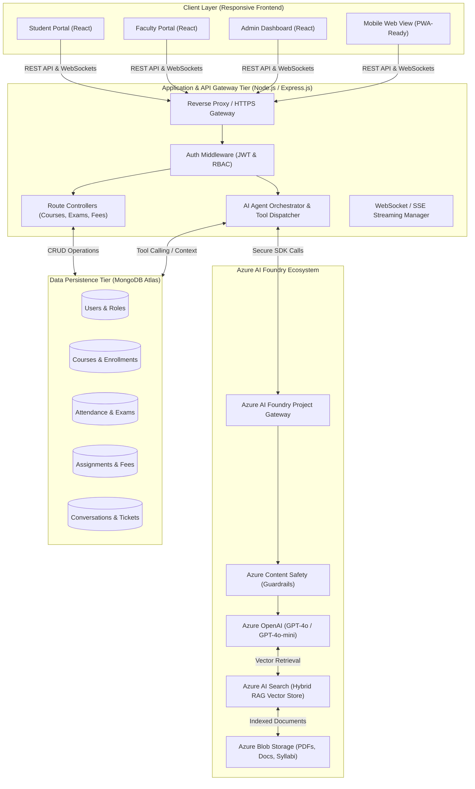
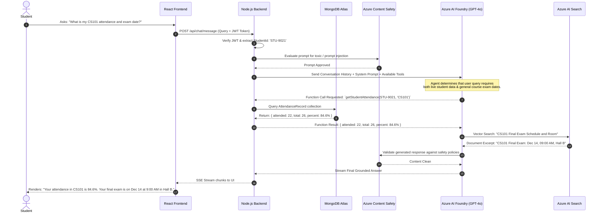
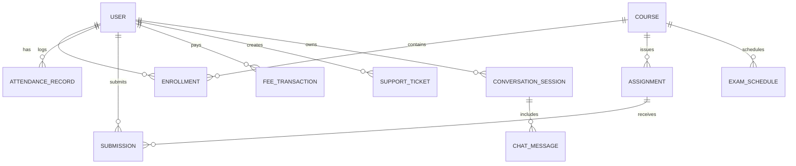

# University Student Support Agent (UniAssist AI)
## Enterprise Project Plan & System Design Document

---

## 1. Problem Statement

Modern higher education institutions face an unprecedented challenge in delivering timely, accurate, and personalized academic and administrative support to students. Universities operate across fragmented administrative silos:
- **Disparate Systems:** Learning Management Systems (LMS, e.g., Canvas/Moodle), Student Information Systems (SIS, e.g., Banner/PeopleSoft), Registrar records, Bursar/Finance systems, and Departmental notice boards operate independently without a unified interface.
- **Administrative Overload:** Faculty and administrative staff spend over 40% of their working hours answering repetitive student inquiries (e.g., examination dates, syllabus queries, attendance cut-offs, fee deadlines, hall ticket release schedules).
- **Communication Latency & Blindspots:** During peak academic windows (enrollment periods, midterms, final examinations, fee due dates), administrative helpdesks experience severe ticket backlogs, leading to student frustration, missed deadlines, financial late fees, and academic distress.
- **Lack of 24/7 Accessibility:** Traditional university offices operate on restricted hours (9 AM – 5 PM), whereas modern students study and require support late at night or during weekends.
- **Inconsistent Answers:** Informal advice across departments often contradicts official university policy, leading to compliance and governance issues.

**UniAssist AI** bridges this gap by introducing an intelligent, role-aware, multimodal virtual student support agent powered by the **MERN Stack** and **Azure AI Foundry**. It centralizes student queries, automates transactional self-service actions, and provides conversational access grounded directly in official university documents and live database records.

---

## 2. Project Objectives

### 2.1 Primary Objectives
- **Centralized Conversational Support:** Deploy an enterprise-grade AI chatbot integrated with Azure AI Foundry that answers student, faculty, and administrative queries 24/7 with under 2.5 seconds streaming response latency.
- **Data Grounding & Zero-Hallucination RAG:** Implement Retrieval-Augmented Generation (RAG) using Azure AI Search to ground responses exclusively on verified university documents (academic policies, course syllabi, fee structures, exam guidelines).
- **Transactional Self-Service:** Enable the AI agent to execute secure tool calls to retrieve personalized real-time student data (attendance percentages, outstanding fee balances, personalized exam schedules, upcoming assignment deadlines).
- **Workload Reduction for Faculty and Staff:** Deflect at least 65% of routine tier-1 academic and administrative support queries away from faculty inboxes and registrar ticketing queues.
- **Human-in-the-Loop Escalation:** Seamlessly transition unresolvable, sensitive, or high-urgency queries into support tickets assigned to designated faculty or administration departments.

### 2.2 SMART Metrics & KPIs
| Metric | Baseline (Manual) | Target (UniAssist AI) |
| :--- | :--- | :--- |
| **First Response Time (Tier-1)** | 12 – 48 Hours | < 3 Seconds |
| **First Contact Resolution (FCR)** | 45% | > 85% |
| **Support Staff Ticket Volume** | 10,000+ / month | < 3,500 / month (65% reduction) |
| **System Uptime & Availability** | 8 hrs/day (Business days) | 99.9% 24/7/365 |
| **Student Satisfaction (CSAT)** | 62% | > 90% |

---

## 3. Project Scope

```
┌─────────────────────────────────────────────────────────────────────────┐
│                          UNIASSIST AI SCOPE                             │
├───────────────────────────────────┬─────────────────────────────────────┤
│             IN-SCOPE              │            OUT-OF-SCOPE             │
├───────────────────────────────────┼─────────────────────────────────────┤
│ • Responsive Web Portal (MERN)    │ • Direct automated payment gateway  │
│ • Student, Faculty, Admin Dash    │   merchant settlement (redirects    │
│ • Azure AI Foundry RAG & Agents   │   to external bursar gateway)       │
│ • Real-time Course & Syllabus     │ • Automated student grading/scoring │
│ • Attendance Tracking & Alerts    │ • Legal / medical counseling        │
│ • Exam Timetable & Calendar Sync  │ • Physical campus biometric hardware│
│ • Assignment Deadlines & Reminders│   access control integration        │
│ • Fee Breakdown & Balance Check   │ • Real-time automated proctoring    │
│ • Campus Services Directory       │ • Official degree parchment printing│
│ • Dynamic FAQ & KB Management     │                                     │
│ • Human-in-the-loop Escalation    │                                     │
│ • Role-Based Access Control (RBAC)│                                     │
└───────────────────────────────────┴─────────────────────────────────────┘
```

### 3.1 In-Scope Deliverables
1. **Student Web Portal:** Modern responsive single-page application (SPA) with dark/light themes, conversational agent widget, academic calendar, dashboard cards, and notification center.
2. **Faculty Management Portal:** Dashboard for reviewing assigned courses, managing syllabus uploads, monitoring student attendance metrics, posting assignment updates, and answering escalated academic tickets.
3. **University Administration Portal:** Enterprise panel for knowledge base ingestion (uploading official PDFs/guidelines to Azure AI Search), user account management, analytics dashboard, ticket triage, and system audit logs.
4. **Intelligent Conversational Agent:** Azure AI Foundry agent orchestration with Hybrid Vector/Semantic search, function calling into MongoDB endpoints, and safety guardrails (Azure Content Safety).
5. **Core Student Service Modules:**
   - Course Information & Syllabus exploration
   - Attendance tracking with threshold alerts (< 75% minimum warning)
   - Exam schedules, venue details, and digital seat cards
   - Assignment tracker with automated status updates
   - Fee summary, balance inquiry, and deadline alerts
   - Campus services directory (housing, dining, medical, library, IT support)
   - Categorized FAQ engine with dynamic semantic search
6. **Security & Compliance:** JSON Web Token (JWT) authentication, RBAC, FERPA/GDPR compliance measures, data encryption at rest (AES-256) and in transit (TLS 1.3).

### 3.2 Out-of-Scope (Future Enhancements)
- Processing actual credit card transactions directly (system provides fee breakdown and generates direct payment links to third-party merchant bank gateways).
- Automated AI-driven subjective assignment grading.
- Crisis/psychological counseling (AI provides hard-coded emergency contact numbers and hotlines when mental health triggers are detected, bypassing LLM generation).
- Integration with physical hardware turnstiles and biometric access doors.

---

## 4. Comprehensive Features List

### 4.1 Student Support & AI Chatbot Module
- **24/7 Conversational AI:** Natural language conversational assistant grounded in university policy and student database records.
- **Context-Aware Memory:** Session-based conversation memory allowing multi-turn queries (e.g., *"What is my attendance in CS101?"* followed by *"Am I eligible for the final exam?"*).
- **Streaming Response with Rich Markdown:** Code snippets, tables, links to forms, clickable phone numbers, and downloadable attachments rendered natively.
- **Personalized Function Calling:** Autonomous fetching of student-specific records (grades, attendance, fees, schedules) via verified authenticated tokens.
- **Safety & Fallback:** Instant routing to human counselors/advisors when the agent detects low confidence or emotionally distressed input.

### 4.2 Course Information & Academic Hub
- **Course Catalog & Search:** Search by course code, department, instructor, or keywords.
- **Syllabus & Learning Outcomes:** View weekly lecture breakdowns, recommended textbooks, and evaluation rubrics.
- **Prerequisite Visualizer:** Visual checklist of completed vs. required prerequisites for enrollment.
- **Faculty Office Hours:** Real-time visibility into instructor availability, office locations, and virtual meeting links.

### 4.3 Attendance Tracking & Warning System
- **Real-Time Attendance Dashboard:** Subject-wise percentage, total classes conducted, attended, and missed.
- **Critical Threshold Visualizer:** Automatic color-coded visual indicator (Green: $\ge 80\%$, Amber: $75\% - 79\%$, Red: $< 75\%$).
- **Bunk Calculator / Attendance Forecast:** Interactive simulator calculating how many consecutive classes a student can safely miss or must attend to remain eligible for examinations.
- **Medical Leave Submission:** Student upload of medical certificates with faculty verification workflow.

### 4.4 Exam Schedule & Hall Ticket Support
- **Personalized Exam Timetable:** Aggregated view of mid-term and end-term dates, start/end times, and designated examination halls.
- **Digital Seat Card & Hall Ticket:** View room numbers, seat/desk allocations, and invigilator guidelines.
- **Calendar Synchronization:** Export examination dates to Google Calendar, Apple Calendar, and Outlook via `.ics` download.
- **Clash Detection & Grievance Reporting:** One-click dispute raising for concurrent examination schedules.

### 4.5 Assignment Reminders & Academic Tracker
- **Unified Assignment Tracker:** Aggregation of upcoming assignments across all enrolled subjects with countdown timers.
- **Submission Status:** Differentiates between *Pending*, *Submitted*, *Graded*, and *Overdue*.
- **Automated Alerts:** In-app badges and simulated email notifications sent 72 hours, 24 hours, and 2 hours prior to deadlines.
- **Rubrics & Submission Links:** Instant access to assignment prompt guidelines and LMS submission portal links.

### 4.6 Fee Breakdown & Financial Aid Information
- **Account Ledger:** Clear itemization of tuition fees, lab fees, library deposits, campus amenities, and hostel/mess dues.
- **Due Date Reminders:** Proactive alerts for upcoming installments to prevent late-fine penalties.
- **Receipts & Payment History:** Downloadable PDF payment receipts and transaction reference IDs.
- **Scholarship & Financial Aid FAQ:** Agent answers eligibility criteria, deadlines, and documentation requirements for institutional scholarships.

### 4.7 Campus Services & Facilities Directory
- **Departmental Directory:** Contact info, physical building/room coordinates, and operational hours for Campus Health, Housing/Hostel, Library, IT Helpdesk, Career Center, and Sports Facilities.
- **Interactive Campus Map Navigator:** Categorized campus locations with key landmark references.
- **Service Request Portal:** Raise routine non-academic requests (e.g., hostel maintenance, library card replacement, campus Wi-Fi troubleshooting).

### 4.8 Knowledge Base & Dynamic FAQ System
- **Categorized Knowledge Repository:** Organized by Admissions, Academics, Financial, Campus Life, and Technical Support.
- **Hybrid Search Engine:** Instant lookup powered by Azure AI Search semantic ranking alongside conventional keyword matching.
- **Faculty/Admin Content Manager:** Easy WYSIWYG editor for staff to publish and update official FAQs without redeploying code.

### 4.9 Faculty & Administrative Management
- **Faculty Panel:** Course management, manual/bulk attendance marking, assignment creation, student academic risk monitoring, and office hour scheduling.
- **Admin Panel:**
  - AI Document Knowledge Ingestion (drag-and-drop university PDFs, syllabi, rulebooks directly into Azure AI Search indexing pipeline).
  - Student & Faculty User Account provisioning and role assignments.
  - Conversational Analytics: Popular student questions, unanswered queries, sentiment breakdown, peak usage hours.
  - Escalated Support Ticket Queue: Kanban board for resolving student queries transferred from the AI agent.

---

## 5. System Architecture

### 5.1 Architecture Overview
The UniAssist AI system utilizes a **Decoupled 3-Tier Enterprise Architecture** augmented with an **Azure AI Foundry Intelligent Agent Engine**:
1. **Presentation Tier (Client):** Single Page Application built with React.js, Tailwind/Vanilla CSS, Vite, Axios, and Socket.io Client for real-time streaming.
2. **Application & Orchestration Tier (Server):** Node.js and Express.js REST API layer handling authentication, business logic, RBAC, database caching, and AI orchestration.
3. **AI Cognitive & Search Tier (Azure):** Azure AI Foundry hosting Azure OpenAI models (GPT-4o / GPT-4o-mini), Azure AI Search (Vector + Hybrid Semantic RAG), and Azure Content Safety.
4. **Data Persistence Tier:** MongoDB Atlas cluster with collections for application entities and indexed document metadata.

### 5.2 High-Level Architecture Diagram



### 5.3 AI Agent RAG & Function Calling Sequence Diagram



### 5.4 Azure AI Foundry Integration Architecture
- **Model Selection:**
  - **GPT-4o-mini:** Primary model for tier-1 natural language routing, FAQ answering, and simple JSON function parameter parsing (optimized for high speed and minimal cost).
  - **GPT-4o:** Complex query parsing, multi-hop reasoning (e.g., cross-referencing university prerequisite trees and credit limits), and policy dispute evaluation.
- **Embedding Model:** `text-embedding-3-large` (3072 dimensions) with cosine similarity and semantic reranker enabled in Azure AI Search.
- **Knowledge Ingestion Pipeline:**
  1. Administrators upload university documents (PDFs, DOCX, FAQs) via the admin UI.
  2. Backend pushes files to **Azure Blob Storage**.
  3. Azure AI Foundry Document Cracking & Chunking pipeline segments documents into 500-token chunks with 100-token overlap.
  4. Embeddings generated via Azure OpenAI and written to **Azure AI Search Index** with metadata filtering (department, semester, document type).
- **Safety Guardrails:** Real-time screening through Azure AI Content Safety to intercept hate speech, self-harm signals, profanity, and prompt injection attempts.

---

## 6. Database Design (MongoDB Mongoose Schemas)

### 6.1 Entity Relationship Overview
The system relies on a high-performance, document-oriented schema optimized for read-heavy student inquiries and flexible metadata.



---

### 6.2 Detailed Collection Schemas

#### 1. `users` Collection
Stores authentication, personal profile details, and role specifications.
```javascript
const UserSchema = new mongoose.Schema({
  userId: { type: String, required: true, unique: true, index: true }, // e.g., "STU-2024-001"
  email: { type: String, required: true, unique: true, lowercase: true, index: true },
  passwordHash: { type: String, required: true },
  fullName: { type: String, required: true },
  role: { 
    type: String, 
    enum: ['student', 'faculty', 'department_admin', 'super_admin'], 
    default: 'student',
    index: true 
  },
  department: { type: String, required: true }, // e.g., "Computer Science"
  studentProfile: {
    enrollmentYear: { type: Number },
    currentSemester: { type: Number },
    degreeProgram: { type: String }, // e.g., "B.Tech Computer Science"
    section: { type: String },
    advisorId: { type: mongoose.Schema.Types.ObjectId, ref: 'User' }
  },
  facultyProfile: {
    designation: { type: String }, // e.g., "Associate Professor"
    officeRoom: { type: String },
    officeHours: [{ day: String, startTime: String, endTime: String }]
  },
  isActive: { type: Boolean, default: true },
  phoneNumber: { type: String },
  avatarUrl: { type: String },
  createdAt: { type: Date, default: Date.now },
  updatedAt: { type: Date, default: Date.now }
});
```

#### 2. `courses` Collection
Catalog of all academic courses offered by the university.
```javascript
const CourseSchema = new mongoose.Schema({
  courseCode: { type: String, required: true, unique: true, uppercase: true, index: true }, // e.g. "CS301"
  title: { type: String, required: true },
  description: { type: String },
  credits: { type: Number, required: true },
  department: { type: String, required: true, index: true },
  semester: { type: Number, required: true },
  leadInstructorId: { type: mongoose.Schema.Types.ObjectId, ref: 'User', required: true },
  syllabusDocumentUrl: { type: String },
  prerequisites: [{ type: String }], // Array of courseCodes
  schedule: [{
    dayOfWeek: { type: String, enum: ['Monday', 'Tuesday', 'Wednesday', 'Thursday', 'Friday', 'Saturday'] },
    startTime: { type: String }, // "10:00 AM"
    endTime: { type: String },   // "11:30 AM"
    roomNumber: { type: String }
  }],
  isActive: { type: Boolean, default: true }
});
```

#### 3. `enrollments` Collection
Associates students with active courses for specific academic terms.
```javascript
const EnrollmentSchema = new mongoose.Schema({
  studentId: { type: mongoose.Schema.Types.ObjectId, ref: 'User', required: true, index: true },
  courseId: { type: mongoose.Schema.Types.ObjectId, ref: 'Course', required: true, index: true },
  academicYear: { type: String, required: true }, // e.g. "2024-2025"
  semester: { type: Number, required: true },
  enrolledAt: { type: Date, default: Date.now },
  status: { type: String, enum: ['active', 'dropped', 'completed'], default: 'active' },
  grade: { type: String, default: 'IN_PROGRESS' }
});
EnrollmentSchema.index({ studentId: 1, courseId: 1, academicYear: 1, semester: 1 }, { unique: true });
```

#### 4. `attendance_records` Collection
Granular attendance tracking for automated calculation and alerts.
```javascript
const AttendanceRecordSchema = new mongoose.Schema({
  courseId: { type: mongoose.Schema.Types.ObjectId, ref: 'Course', required: true, index: true },
  studentId: { type: mongoose.Schema.Types.ObjectId, ref: 'User', required: true, index: true },
  date: { type: Date, required: true, index: true },
  status: { type: String, enum: ['present', 'absent', 'late', 'excused'], required: true },
  markedBy: { type: mongoose.Schema.Types.ObjectId, ref: 'User' }, // Faculty or Admin
  remarks: { type: String }
});
AttendanceRecordSchema.index({ courseId: 1, studentId: 1, date: 1 }, { unique: true });
```

#### 5. `exam_schedules` Collection
Maintains mid-term and final examination timetables and room seat plans.
```javascript
const ExamScheduleSchema = new mongoose.Schema({
  courseId: { type: mongoose.Schema.Types.ObjectId, ref: 'Course', required: true, index: true },
  examType: { type: String, enum: ['Quiz', 'Midterm', 'Final', 'Practical'], required: true },
  academicTerm: { type: String, required: true }, // "Fall 2024"
  examDate: { type: Date, required: true, index: true },
  startTime: { type: String, required: true }, // "09:00 AM"
  endTime: { type: String, required: true },   // "12:00 PM"
  roomNumber: { type: String, required: true },
  building: { type: String, required: true },
  totalMarks: { type: Number, required: true },
  instructions: [{ type: String }],
  seatingArrangements: [{
    studentId: { type: mongoose.Schema.Types.ObjectId, ref: 'User' },
    seatNumber: { type: String }
  }]
});
```

#### 6. `assignments` & `submissions` Collections
Tracks deliverables, due dates, and student submission status.
```javascript
const AssignmentSchema = new mongoose.Schema({
  courseId: { type: mongoose.Schema.Types.ObjectId, ref: 'Course', required: true, index: true },
  title: { type: String, required: true },
  description: { type: String, required: true },
  assignedDate: { type: Date, default: Date.now },
  dueDate: { type: Date, required: true, index: true },
  maxPoints: { type: Number, required: true },
  attachmentUrl: { type: String }
});

const SubmissionSchema = new mongoose.Schema({
  assignmentId: { type: mongoose.Schema.Types.ObjectId, ref: 'Assignment', required: true, index: true },
  studentId: { type: mongoose.Schema.Types.ObjectId, ref: 'User', required: true, index: true },
  submittedAt: { type: Date, default: Date.now },
  fileUrl: { type: String, required: true },
  status: { type: String, enum: ['submitted', 'late', 'graded'], default: 'submitted' },
  score: { type: Number },
  feedback: { type: String }
});
```

#### 7. `fee_accounts` & `fee_transactions` Collections
Financial ledger tracking student tuition dues, payments, and invoices.
```javascript
const FeeAccountSchema = new mongoose.Schema({
  studentId: { type: mongoose.Schema.Types.ObjectId, ref: 'User', required: true, unique: true, index: true },
  academicYear: { type: String, required: true },
  totalAssessed: { type: Number, required: true }, // e.g. $12,500
  totalPaid: { type: Number, default: 0 },
  outstandingBalance: { type: Number, required: true },
  nextDueDate: { type: Date, required: true },
  status: { type: String, enum: ['cleared', 'partial', 'overdue'], default: 'cleared' }
});

const FeeTransactionSchema = new mongoose.Schema({
  studentId: { type: mongoose.Schema.Types.ObjectId, ref: 'User', required: true, index: true },
  feeAccountId: { type: mongoose.Schema.Types.ObjectId, ref: 'FeeAccount', required: true },
  transactionId: { type: String, required: true, unique: true },
  amount: { type: Number, required: true },
  paymentType: { type: String, enum: ['Tuition', 'Hostel', 'LibraryFine', 'ExamFee'] },
  paymentMethod: { type: String, enum: ['CreditCard', 'DebitCard', 'WireTransfer', 'Scholarship'] },
  paymentDate: { type: Date, default: Date.now },
  receiptUrl: { type: String }
});
```

#### 8. `campus_services` Collection
Directory of all university amenities, contacts, and hours.
```javascript
const CampusServiceSchema = new mongoose.Schema({
  name: { type: String, required: true }, // e.g., "Student Health Center"
  category: { 
    type: String, 
    enum: ['Health', 'Housing', 'Library', 'IT Services', 'Career Center', 'Security'], 
    required: true, 
    index: true 
  },
  location: { type: String, required: true },
  contactPhone: { type: String, required: true },
  contactEmail: { type: String, required: true },
  operationalHours: { type: String, required: true }, // "Mon-Fri 8:00 AM - 6:00 PM"
  description: { type: String },
  emergencyContact: { type: Boolean, default: false }
});
```

#### 9. `faq_items` & `knowledge_documents` Collections
Official knowledge base documents indexed for Azure AI Search.
```javascript
const FaqItemSchema = new mongoose.Schema({
  question: { type: String, required: true },
  answer: { type: String, required: true },
  category: { type: String, required: true, index: true },
  tags: [{ type: String }],
  isPublished: { type: Boolean, default: true },
  viewCount: { type: Number, default: 0 }
});

const KnowledgeDocumentSchema = new mongoose.Schema({
  title: { type: String, required: true },
  category: { type: String, required: true },
  blobUrl: { type: String, required: true },
  azureSearchDocId: { type: String, required: true, unique: true },
  uploadedBy: { type: mongoose.Schema.Types.ObjectId, ref: 'User' },
  uploadedAt: { type: Date, default: Date.now },
  indexingStatus: { type: String, enum: ['pending', 'indexed', 'failed'], default: 'pending' }
});
```

#### 10. `chat_sessions` & `support_tickets` Collections
Session state, message persistence, and human escalation queues.
```javascript
const ChatSessionSchema = new mongoose.Schema({
  userId: { type: mongoose.Schema.Types.ObjectId, ref: 'User', required: true, index: true },
  title: { type: String, default: "New Support Query" },
  startedAt: { type: Date, default: Date.now },
  lastActiveAt: { type: Date, default: Date.now }
});

const ChatMessageSchema = new mongoose.Schema({
  sessionId: { type: mongoose.Schema.Types.ObjectId, ref: 'ChatSession', required: true, index: true },
  sender: { type: String, enum: ['user', 'assistant', 'system', 'agent_tool'], required: true },
  content: { type: String, required: true },
  toolCalls: [{
    toolName: String,
    parameters: mongoose.Schema.Types.Mixed,
    result: mongoose.Schema.Types.Mixed
  }],
  feedbackScore: { type: Number, min: 1, max: 5 }, // Optional student thumbs up/down
  timestamp: { type: Date, default: Date.now }
});

const SupportTicketSchema = new mongoose.Schema({
  ticketNumber: { type: String, required: true, unique: true, index: true }, // e.g. "TICK-1002"
  studentId: { type: mongoose.Schema.Types.ObjectId, ref: 'User', required: true, index: true },
  subject: { type: String, required: true },
  description: { type: String, required: true },
  category: { type: String, enum: ['Academic', 'Financial', 'Administrative', 'Technical'], required: true },
  priority: { type: String, enum: ['low', 'medium', 'high', 'urgent'], default: 'medium' },
  status: { type: String, enum: ['open', 'in_progress', 'resolved', 'closed'], default: 'open' },
  assignedTo: { type: mongoose.Schema.Types.ObjectId, ref: 'User' }, // Faculty or Admin staff
  chatSessionRef: { type: mongoose.Schema.Types.ObjectId, ref: 'ChatSession' },
  resolutionNotes: { type: String },
  createdAt: { type: Date, default: Date.now },
  resolvedAt: { type: Date }
});
```

---

## 7. User Roles & Access Control (RBAC Matrix)

The system enforces strict multi-tenant Role-Based Access Control (RBAC) at both the API Gateway level and within the AI Agent Tool Execution sandbox.

### 7.1 Role Definitions
1. **Student (`student`):**
   - End-user with access to their own personalized academic, attendance, fee, and exam data.
   - Allowed to interact with the AI Agent, search FAQs, download syllabi, view schedules, and create support escalation tickets.
   - Forbidden from viewing other students' private data or modifying course/exam records.
2. **Faculty (`faculty`):**
   - Academic instructors and professors.
   - Access to courses they are assigned to teach.
   - Allowed to take attendance, create/modify assignments, upload syllabi, review student attendance alerts, and resolve student academic queries.
3. **University Administration (`department_admin` / `super_admin`):**
   - Department heads, registrar staff, bursars, and IT system administrators.
   - Full access to manage course catalogs, upload official university documentation to Azure AI Search, manage user accounts, oversee fee ledgers, and analyze institution-wide support trends.

### 7.2 Granular RBAC Permissions Matrix

| Resource / Action | Student | Faculty | Dept Admin | Super Admin |
| :--- | :---: | :---: | :---: | :---: |
| **Conversational AI Agent (Public RAG)** | ✅ Read | ✅ Read | ✅ Read | ✅ Read |
| **Personal Attendance View** | ✅ Read (Own) | ✅ Read (Enrolled) | ✅ Read (Dept) | ✅ Read (All) |
| **Mark / Edit Attendance** | ❌ No Access | ✅ Write (Own Course) | ✅ Write (Dept) | ✅ Write (All) |
| **Course Information & Syllabi** | ✅ Read | ✅ Read & Edit (Assigned) | ✅ Full CRUD (Dept) | ✅ Full CRUD |
| **Exam Schedules & Seat Cards** | ✅ Read (Personal) | ✅ Read (Assigned) | ✅ Full CRUD (Dept) | ✅ Full CRUD |
| **Assignment Submission** | ✅ Create/Submit | ❌ No Access | ❌ No Access | ❌ No Access |
| **Assignment Management (Post/Grade)** | ❌ No Access | ✅ Full CRUD | ✅ Read/Audit | ✅ Full CRUD |
| **Fee Ledgers & Invoices** | ✅ Read (Personal) | ❌ No Access | ✅ Read/Write (Bursar) | ✅ Full CRUD |
| **Campus Services & FAQ Directory** | ✅ Read | ✅ Read | ✅ Write/Manage | ✅ Full CRUD |
| **Upload Documents to Azure Search** | ❌ No Access | ❌ No Access | ✅ Upload (Dept) | ✅ Full CRUD |
| **Support Ticket Queue & Triage** | ✅ Create (Own) | ✅ Resolve (Academic) | ✅ Assign & Resolve | ✅ Full CRUD |
| **User & Role Provisioning** | ❌ No Access | ❌ No Access | ❌ No Access | ✅ Full CRUD |
| **System Audit Logs & Analytics** | ❌ No Access | ❌ No Access | ✅ Read (Dept) | ✅ Full CRUD |

---

## 8. Technology Stack Specification

```
┌────────────────────────────────────────────────────────────────────────┐
│                        UNIASSIST AI TECH STACK                         │
├─────────────────┬──────────────────────────────────────────────────────┤
│ Frontend        │ React 18+ (Vite), Modern Vanilla CSS / Custom Design  │
│                 │ System, Lucide Icons, Axios, Socket.io-client        │
├─────────────────┼──────────────────────────────────────────────────────┤
│ Backend / API   │ Node.js 20+ LTS, Express.js, TypeScript/ES6,         │
│                 │ JSON Web Tokens (JWT), Bcrypt, Express-Rate-Limit    │
├─────────────────┼──────────────────────────────────────────────────────┤
│ Database        │ MongoDB Atlas (Replica Set), Mongoose ODM 8+         │
├─────────────────┼──────────────────────────────────────────────────────┤
│ Azure AI & Cloud│ • Azure AI Foundry (Project & Agent Orchestration)   │
│                 │ • Azure OpenAI Service (GPT-4o & GPT-4o-mini)        │
│                 │ • Azure AI Search (Semantic Vector Hybrid Search)    │
│                 │ • Azure AI Content Safety (Prompt injection defense) │
│                 │ • Azure Blob Storage (Document & Syllabus Storage)   │
├─────────────────┼──────────────────────────────────────────────────────┤
│ DevOps & Tooling│ Docker, GitHub Actions CI/CD, Nginx, Vitest, Postman │
└─────────────────┴──────────────────────────────────────────────────────┘
```

---

## 9. Implementation Roadmap & Milestones

The project will be delivered in **4 Phases over 10 Weeks**:

### Phase 1: Foundation & Data Infrastructure (Weeks 1 – 3)
- [x] Establish MongoDB database collections and Mongoose models with validation.
- [x] Implement Express.js backend with JWT authentication, RBAC middleware, and standard CRUD APIs for Users, Courses, Attendance, Assignments, Exams, and Fees.
- [x] Configure Azure AI Foundry project, provision Azure OpenAI (GPT-4o/GPT-4o-mini), Azure AI Search instance, and Azure Blob Storage.
- [x] Seed representative university test data across all collections.

### Phase 2: AI Knowledge Ingestion & Agent Tool Orchestration (Weeks 4 – 5)
- [x] Implement Azure AI Search indexing pipeline (chunking, vectorizing with `text-embedding-3-large`, and semantic search config).
- [x] Develop backend Tool Dispatcher providing function calling for:
  - `getStudentAttendance(studentId, courseCode)`
  - `getExamSchedule(studentId)`
  - `getPendingAssignments(studentId)`
  - `getFeeStatus(studentId)`
  - `getCourseSyllabus(courseCode)`
- [x] Integrate Azure Content Safety filtering on user inputs and LLM outputs.
- [x] Implement Server-Sent Events (SSE) / WebSocket endpoint for real-time text streaming.

### Phase 3: Frontend Application & Role Portals (Weeks 6 – 8)
- [x] Build responsive web interface with custom design tokens (dark/light themes, accessible glassmorphism, responsive navigation).
- [x] Develop **Student Portal**: Chatbot assistant widget, attendance dashboard with threshold gauge, timetable viewer, assignment checklist, fee status card.
- [x] Develop **Faculty Portal**: Attendance entry table, assignment manager, and ticket resolution inbox.
- [x] Develop **Admin Portal**: Document upload to Azure AI Search, FAQ editor, ticket Kanban board, and usage analytics.

### Phase 4: Quality Assurance, Security Hardening & Deployment (Weeks 9 – 10)
- [x] End-to-end integration testing (simulating 50+ diverse student inquiries and edge cases).
- [x] FERPA/GDPR compliance verification: verify no student can access unauthorized data through conversational prompt injection.
- [x] Performance optimization: Redis caching for static course schedules and FAQ lists.
- [x] Final production deployment via Docker containers and Azure App Services.

---

## 10. Summary
This project plan provides an enterprise-ready blueprint for building the **University Student Support Agent (UniAssist AI)**. By combining the agility of the **MERN Stack** with the enterprise reasoning, grounding, and security capabilities of **Azure AI Foundry**, universities can achieve a 24/7 intelligent campus assistant that drastically reduces administrative burden while empowering students with immediate, accurate, and personalized academic guidance.
